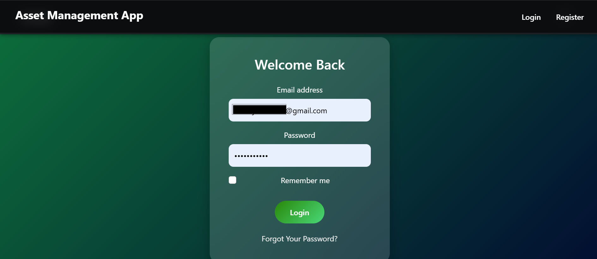
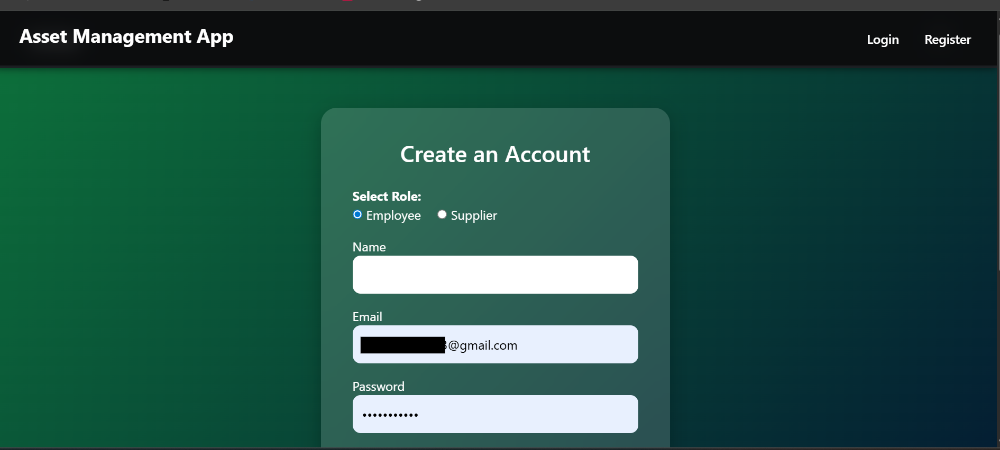
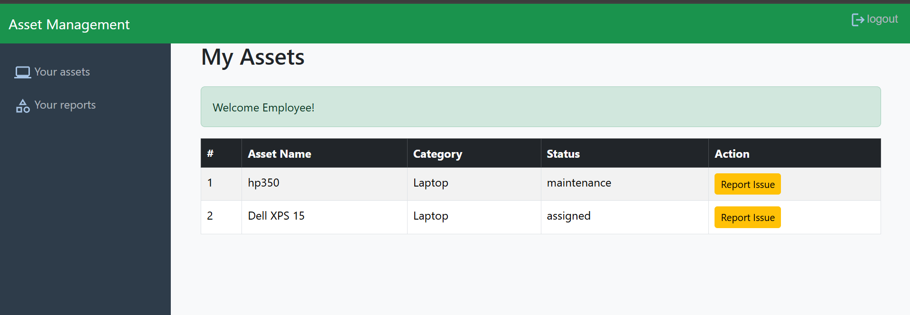
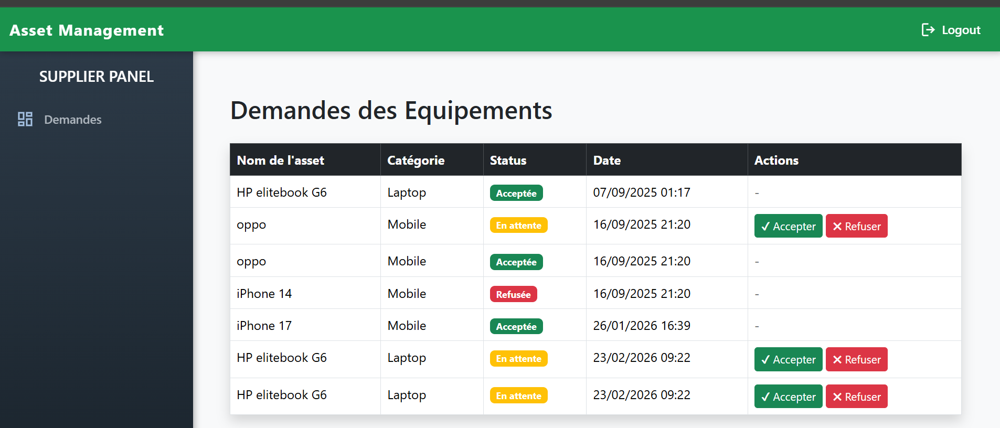

# IT Asset Management System 🖥️

A web-based application for managing IT assets within an organization, including asset tracking, employee assignments, maintenance, and supplier requests.

Built as part of an academic project in Management Information Systems.

## 🎯 Purpose

This project was built to simulate a real-world IT asset management system used in organizations.

It demonstrates:
- Role-based access control (Admin, Employee, Supplier)
- Relational database design
- Full-stack web development using Laravel
- Business workflow automation

## 🚀 Features

### 👨‍💼 Admin
- Manage employees and departments
- Add, update, and delete assets
- Categorize assets
- Assign assets to employees
- Send supply requests to suppliers
- Track maintenance records

### 🧑‍🔧 Employee
- View assigned assets
- Report malfunctioning assets

### 🚚 Supplier
- Receive supply requests
- Accept or refuse requests

## 🛠️ Tech Stack

- Backend: PHP (Laravel)
- Frontend: HTML, CSS, JavaScript
- Database: MySQL
- Architecture: MVC

## 🗄️ Database Structure

Main tables:
- admins
- employees
- departments
- assets
- categories
- assignments
- maintenance_records
- suppliers
- requests

## ⚙️ Installation

1. Clone the repository:
```bash
git clone https://github.com/AbdeljalilSALMI/Asset-management-App-.git
cd Asset-management-App-
2.
composer install
3.
cp .env.example .env
4.
php artisan key:generate
5.
php artisan db:seed
6.
php artisan serve
```
## 📸 Screenshots

### Login Page


### Registration Page


### Admin Dashboard


### Employee View


### Supplier View



## 🔄 Workflow

1. Admin adds assets to the system
2. Admin assigns assets to employees
3. Employee reports issues
4. Admin creates maintenance request
5. Supplier processes supply requests


## 👤 Author

Abdeljalil_Salmi
Student in Management Information Systems @ ENSA KHOURIBGA MOROCCO